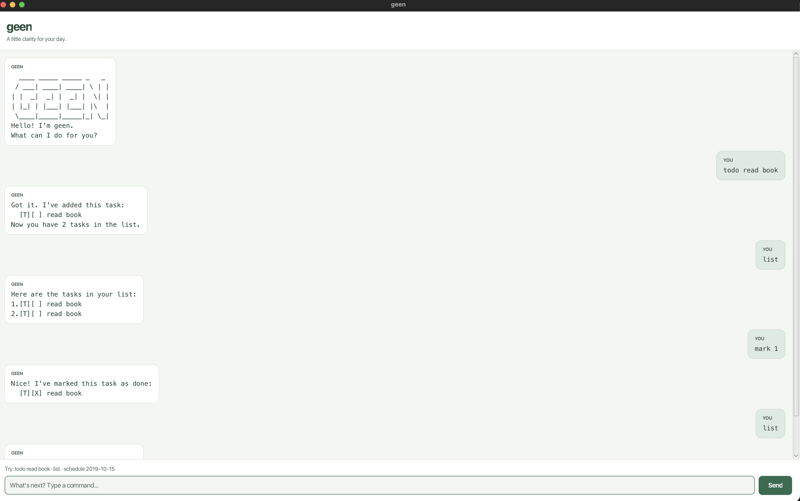

# geen User Guide

geen is a small personal assistant chatbot for tracking todos, deadlines, and
events. It helps you keep a simple task list, search it, and view what is
scheduled for a date.



## Quick Start

1. Launch geen.
2. Type a command into the input box.
3. Press Enter or click Send.
4. Use `list` whenever you want to see your current tasks.
5. Use `bye` when you are done.

Dates must use the `yyyy-MM-dd` format, such as `2019-10-15`.

## Features

### Add a Todo

Use `todo DESCRIPTION` for a task with no date.

Example:

```text
todo read book
```

Expected result:

```text
Got it. I've added this task:
  [T][ ] read book
Now you have 1 tasks in the list.
```

### Add a Deadline

Use `deadline DESCRIPTION /by DATE` for a task that is due on a date.

Example:

```text
deadline return book /by 2019-10-15
```

Expected result:

```text
Got it. I've added this task:
  [D][ ] return book (by: Oct 15 2019)
Now you have 2 tasks in the list.
```

### Add an Event

Use `event DESCRIPTION /from START_DATE /to END_DATE` for something that lasts
for one or more days.

Example:

```text
event project meeting /from 2019-10-15 /to 2019-10-16
```

Expected result:

```text
Got it. I've added this task:
  [E][ ] project meeting (from: Oct 15 2019 to: Oct 16 2019)
Now you have 3 tasks in the list.
```

The end date cannot be before the start date. Same-day events are allowed.

### List Tasks

Use `list` to show all saved tasks.

Example:

```text
list
```

Expected result:

```text
Here are the tasks in your list:
1.[T][ ] read book
2.[D][ ] return book (by: Oct 15 2019)
3.[E][ ] project meeting (from: Oct 15 2019 to: Oct 16 2019)
```

### Mark or Unmark a Task

Use `mark NUMBER` to mark a task as done. Use `unmark NUMBER` to mark it as not
done yet. The number is the task number shown by `list`.

Examples:

```text
mark 1
unmark 1
```

### Delete a Task

Use `delete NUMBER` to remove a task. The remaining tasks are renumbered
automatically.

Example:

```text
delete 2
```

### Find Tasks

Use `find KEYWORD` to show tasks whose descriptions contain the keyword.

Example:

```text
find book
```

Expected result:

```text
Here are the matching tasks in your list:
1.[T][ ] read book
2.[D][ ] return book (by: Oct 15 2019)
```

### View a Schedule

Use `schedule DATE` to view deadlines due on that date and events taking place
on that date.

Example:

```text
schedule 2019-10-15
```

Expected result:

```text
Schedule for Oct 15 2019:
1.[D][ ] return book (by: Oct 15 2019)
2.[E][ ] project meeting (from: Oct 15 2019 to: Oct 16 2019)
```

Events spanning multiple days appear on their start date, end date, and every
date between them. Todos are not shown in the schedule because they have no
scheduled date.

### Exit

Use `bye` to end the chat.

Example:

```text
bye
```

## Command Summary

- `todo DESCRIPTION`
- `deadline DESCRIPTION /by DATE`
- `event DESCRIPTION /from START_DATE /to END_DATE`
- `list`
- `mark NUMBER`
- `unmark NUMBER`
- `delete NUMBER`
- `find KEYWORD`
- `schedule DATE`
- `bye`

## Error Handling

geen tries to explain what went wrong and gives an example when possible. For
example, if you type `deadline return book /by Sunday`, geen will remind you to
use the `yyyy-MM-dd` date format.

If the saved data file is missing, geen starts with an empty task list. If the
saved data file is unreadable or contains invalid task data, geen shows an error
message instead of crashing.

## Saving Data

geen saves your tasks automatically after changes. You do not need to run a save
command.

## Credits

This project builds on the CS2103T iP starter template. The geen-specific GUI,
error handling, tests, documentation, and ASCII banner were written for this
project with AI assistance. No external project code or third-party solution
snippets were copied.
